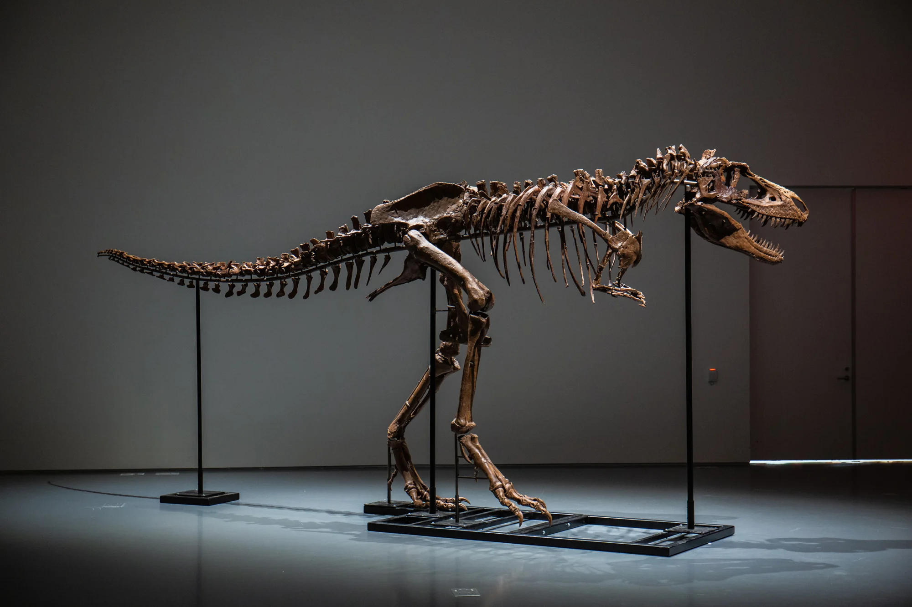

# Welcome to My Data Analytics Portfolio

I'm a **Mechanical Design Engineer** and **certified Data Analyst** with over **6 years of experience** leading end-to-end projects. My passion lies in transforming raw data into meaningful insights, communicating complex ideas in simple terms, and empowering teams to succeed. My approach combines strong attention to detail with a focus on big-picture objectives.

I thrive on solving problems, learning new skills, and making an impact through data. With a commitment to integrity, efficiency, and collaboration, I love creating solutions that serve others—and having fun along the way!

 
---

## Featured Projects

### [Insights Into Student Performance](https://public.tableau.com/app/profile/shahnaz3062/viz/Student-por/Dashboard1)

  

 <em>Image source: <a href="https://www.kaggle.com/datasets/uciml/student-alcohol-consumption/data">Kaggle</a>
</em>

In this project, I analyzed various factors influencing student performance and outcomes, using the [Kaggle Student Alcohol Consumption dataset](https://www.kaggle.com/datasets/uciml/student-alcohol-consumption/data). This dataset, derived from a survey of **secondary school** students enrolled in a **Portuguese language course**, provides valuable insights into social, gender, and study-related aspects of students' lives. 

My dashboard presents a clear and interactive overview of the **data distribution** and highlights the **impact of key factors** such as gender, study time, internet access, parental education, parental marital status, and alcohol consumption on students' academic outcomes.

**Key skills demonstrated:**
- Data visualization with Tableau
- Analyzing relationships between variables
- Dashboard creation and storytelling

---

### [Dinosaur Fossil Record Insights](https://github.com/jshahna/Dinosaur-Fossil-Record-Insights/blob/main/Dinosaurs-fossil-insights.ipynb)

  

<em>Image source:</em> <a href="https://www.cnn.com/style/article/gorgosaurus-dinosaur-skeleton-auction-scn/index.html">CNN</a>

In this project, I explored **dinosaur diversity** and **evolution** using the [Paleobiology Database](https://paleobiodb.org/#/). By leveraging Python and libraries like **Pandas**, **NumPy**, **Seaborn**, and **Matplotlib**, I performed an in-depth **Exploratory Data Analysis (EDA)**. My work uncovered key trends such as the distribution of dinosaur species over time and tested hypotheses on the evolutionary growth of dinosaurs.

**Key skills demonstrated:**
- Data cleaning & handling missing data
- Trend analysis & visualization
- Evolutionary biology insights through data

---

### [King County House Price Prediction](https://github.com/jshahna/King-County-House-Prices/blob/main/Group_Final_Project_CharryDeandres_KanizSyeda_ShahnazJalali.pdf)

  

<em>Image source:</em> <a href="https://www.fau.edu/newsdesk/articles/left-most-digit-on-homes-asking-price-matters-most.php">Florida Atlantic University</a>

This project was the **capstone** of my Certificate program at the **University of Washington**, where I collaborated with a team to develop machine learning algorithms and **predict house prices** in King County. Our focus was on identifying the most important features influencing house prices and building robust predictive models. 

**Key skills demonstrated:**
- Feature engineering & selection
- Building machine learning regression models
- Collaborative project execution & presentation

---

Feel free to explore these projects and connect with me if you'd like to discuss them further! 
